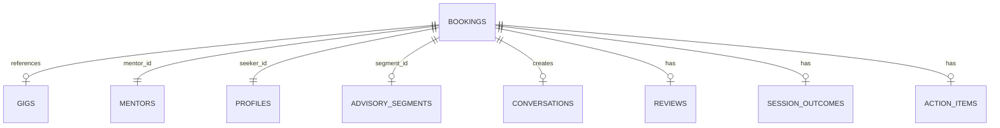
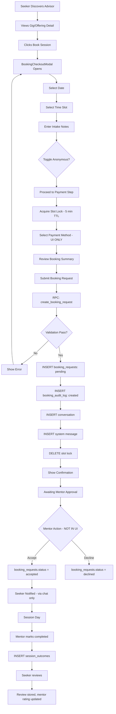
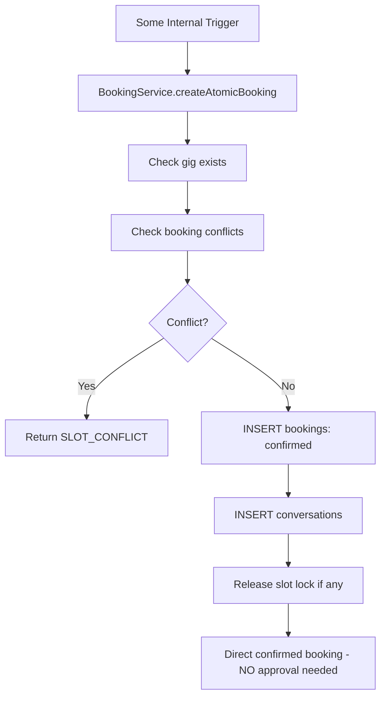
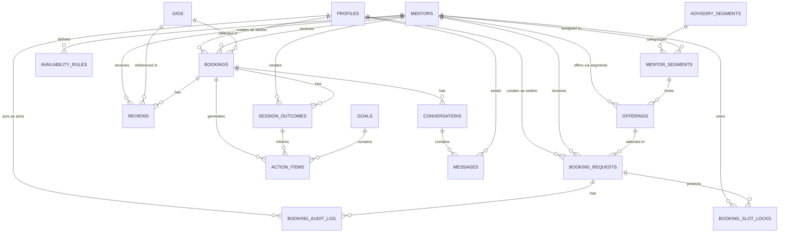

# SUGGEST KEY — BOOKING SYSTEM FORENSIC AUDIT

**Audit Date:** 2026-09-09  
**Auditor:** Kilo (Automated Forensic Audit)  
**Scope:** Complete end-to-end booking lifecycle from discovery through post-session outcomes  
**Status:** READ-ONLY AUDIT — NO CODE, SCHEMA, OR DATA MODIFIED

---

## EXECUTIVE SUMMARY

The Suggest Key platform operates **two parallel booking systems** that are not fully reconciled:

1. **`bookings` table** — Legacy/direct atomic booking system (status: `pending`, `confirmed`, `in_progress`, `completed`, `cancelled`, `failed`)
2. **`booking_requests` table** — Newer request/approval flow (status: `pending`, `accepted`, `declined`, `cancelled`)

The **active UI flow** uses `booking_requests` via the `BookingCheckoutModal` → `BookingRequestService` → `create_booking_request` RPC.  
The **`bookings` table** has an older atomic function `book_session_atomic` and a `BookingService.createAtomicBooking` method that bypasses the request/approval flow and creates directly confirmed bookings.

**Critical Finding:** There is **no real payment implementation**. The `PaymentService` contains only stubs that log warnings. The UI presents a payment step, but no funds are actually collected, held in escrow, or released. Escrow is a **UI/conceptual construct only**.

**Additional Finding:** The `AdminService` references `disputes` and `platform_settings` tables that **do not exist** in the database.

---

## 1. DATABASE SCHEMA FORENSIC SCAN

### 1.1 Complete Table Inventory

| Table | RLS Enabled | Row Count | Purpose |
|-------|-------------|-----------|---------|
| `profiles` | Yes | 24 | User accounts (seeker, mentor, admin) |
| `categories` | Yes | 3 | Legacy categories |
| `advisory_segments` | Yes | 3 | Advisory domain segments |
| `mentors` | Yes | 19 | Mentor profiles |
| `gigs` | Yes | 23 | Legacy advisory offerings |
| `offerings` | Yes | 23 | Newer offerings (seeded from gigs) |
| `mentor_segments` | Yes | 19 | Mentor-to-segment assignments |
| `availability_rules` | Yes | 0 | Mentor weekly availability |
| `bookings` | Yes | 11 | Direct bookings (legacy + atomic) |
| `booking_requests` | Yes | 0 | Booking request/approval flow |
| `booking_audit_log` | Yes | 0 | Audit trail for booking_requests |
| `booking_slot_locks` | Yes | 0 | Temporary 5-min slot reservations |
| `conversations` | Yes | 3 | Chat channels linked to bookings |
| `messages` | Yes | 5 | Chat messages |
| `reviews` | Yes | 11 | Post-session reviews |
| `notifications` | Yes | 0 | User notifications (empty — no producers found) |
| `goals` | Yes | 0 | Seeker goals |
| `action_items` | Yes | 0 | Trackable tasks from sessions |
| `session_outcomes` | Yes | 0 | Post-session structured outcomes |

**Missing Tables (referenced in code but not in database):**
- `disputes` — Referenced in `AdminService.ts` (lines 79, 276-333, 529-531, 563)
- `platform_settings` — Referenced in `AdminService.ts` (lines 373-432, 438-440)

### 1.2 Core Booking Tables — Detailed Schema

#### `bookings` (Legacy/Direct)



| Column | Type | Nullable | Default | Notes |
|--------|------|----------|---------|-------|
| `id` | text | No | `gen_random_uuid()` | Primary key |
| `gig_id` | text | No | — | FK → gigs.id |
| `mentor_id` | uuid | No | — | FK → mentors.id |
| `seeker_id` | uuid | No | — | FK → profiles.id |
| `segment_id` | uuid | Yes | — | FK → advisory_segments.id |
| `start_time` | timestamptz | No | — | Session start |
| `end_time` | timestamptz | No | — | Session end |
| `status` | booking_status | No | `'confirmed'` | pending/confirmed/in_progress/completed/cancelled/failed |
| `amount_inr` | integer | No | 0 | Gross amount |
| `platform_fee_inr` | integer | Yes | 0 | 15% platform cut |
| `mentor_payout_inr` | integer | Yes | 0 | 85% mentor payout |
| `meeting_url` | text | Yes | — | Google Meet URL |
| `notes` | text | Yes | — | Seeker intake context |
| `is_anonymous` | boolean | Yes | false | Privacy shield |
| `is_demo` | boolean | Yes | false | Demo data flag |
| `created_at` | timestamptz | Yes | now() | |
| `updated_at` | timestamptz | Yes | timezone('utc', now()) | |

**Exclusion Constraint:** `no_overlap_mentor_booking` — Prevents double-booking for `pending`, `confirmed`, `in_progress` statuses using GiST range exclusion on `(mentor_id, tstzrange(start_time, end_time))`.

#### `booking_requests` (New Request/Approval Flow)

| Column | Type | Nullable | Default | Notes |
|--------|------|----------|---------|-------|
| `id` | uuid | No | `gen_random_uuid()` | Primary key |
| `offering_id` | uuid | No | — | FK → offerings.id |
| `mentor_id` | uuid | No | — | FK → mentors.id |
| `seeker_id` | uuid | No | — | FK → profiles.id |
| `status` | booking_request_status | No | `'pending'` | pending/accepted/declined/cancelled |
| `proposed_start_time` | timestamptz | No | — | Requested time |
| `proposed_end_time` | timestamptz | No | — | Requested end |
| `confirmed_start_time` | timestamptz | Yes | — | Set on accept |
| `confirmed_end_time` | timestamptz | Yes | — | Set on accept |
| `meeting_url` | text | Yes | — | Set on accept |
| `message` | text | Yes | — | Seeker message to mentor |
| `notes` | text | Yes | — | Additional notes |
| `amount_inr` | integer | No | 0 | Gross amount |
| `platform_fee_inr` | integer | Yes | 0 | 15% |
| `mentor_payout_inr` | integer | Yes | 0 | 85% |
| `is_anonymous` | boolean | Yes | false | |
| `is_demo` | boolean | Yes | false | |
| `created_at` | timestamptz | Yes | now() | |
| `updated_at` | timestamptz | Yes | timezone('utc', now()) | |

**Exclusion Constraint:** `no_overlap_mentor_booking_request` — Prevents double-booking for `pending` and `accepted` statuses.

#### `booking_slot_locks` (5-Minute Temporary Holds)

| Column | Type | Nullable | Default | Notes |
|--------|------|----------|---------|-------|
| `id` | uuid | No | `gen_random_uuid()` | Primary key |
| `mentor_id` | uuid | No | — | FK → mentors.id |
| `seeker_id` | uuid | No | — | FK → profiles.id |
| `range` | tstzrange | No | — | Time range lock |
| `expires_at` | timestamptz | No | now() + 5 min | Auto-expiry |
| `created_at` | timestamptz | No | now() | |

**Indexes:** GiST index on `(mentor_id, range)`, btree index on `expires_at`.

#### `booking_audit_log`

| Column | Type | Nullable | Default | Notes |
|--------|------|----------|---------|-------|
| `id` | uuid | No | `gen_random_uuid()` | Primary key |
| `booking_request_id` | uuid | No | — | FK → booking_requests.id |
| `action` | text | No | — | e.g. 'created', 'accepted', 'declined', 'cancelled' |
| `actor_id` | uuid | No | — | FK → profiles.id |
| `from_status` | booking_request_status | Yes | — | Previous status |
| `to_status` | booking_request_status | Yes | — | New status |
| `metadata` | jsonb | Yes | `{}` | Extra context |
| `created_at` | timestamptz | Yes | now() | |

### 1.3 Supporting Tables

#### `offerings`
- Seeded from `gigs` via migration
- Linked to `mentor_segments` (not directly to mentors)
- `is_available` controls visibility (RLS: only `is_available = true` visible to public)

#### `availability_rules`
- Mentor-defined weekly recurring windows
- `day_of_week` (0=Sunday..6=Saturday), `start_time`, `end_time`, `is_active`
- **Note:** The `MentorStudioService.getAvailability`/`saveAvailability` references `is_enabled` and `slot_duration_minutes`/`buffer_minutes` columns that **do not exist** in the actual table schema. This is a **schema-code mismatch**.

#### `conversations`
- 1:1 with `bookings` via `booking_id` UNIQUE constraint
- `last_message_at` tracks recency

#### `messages`
- Standard chat messages with `attachments` JSONB

#### `reviews`
- `booking_id` UNIQUE — one review per booking
- Sub-ratings: `rating_expertise`, `rating_communication`, `rating_actionability` (1-5)
- `mentor_response` and `mentor_response_at` for mentor replies

#### `session_outcomes`
- 1:1 with `bookings` via `booking_id` UNIQUE
- `key_observations` and `recommended_actions` as text arrays
- `next_checkpoint` date

#### `goals` / `action_items`
- Seeker goal tracking
- Action items can be linked to `booking_id` and `goal_id`

---

## 2. DATABASE FUNCTIONS & RPCs

### 2.1 Booking-Related Functions

| Function | Security | Purpose |
|----------|----------|---------|
| `create_booking_request` | SECURITY INVOKER | Creates a booking request with validation (seeker-only, mentor approved check, slot conflict check) |
| `update_booking_request_status` | SECURITY INVOKER | Transitions booking request status (accept/decline/cancel) with authorization checks |
| `cancel_booking_request` | SECURITY INVOKER | Cancels a booking request (seeker or admin only) |
| `acquire_slot_lock` | SECURITY INVOKER | Creates a 5-minute temporary slot lock |
| `release_slot_lock` | SECURITY INVOKER | Releases a slot lock (owner only) |
| `list_mentor_slots` | SECURITY INVOKER, STABLE | Lists available time slots for a mentor on a given day |
| `purge_expired_slot_locks` | — | Deletes expired slot locks |
| `book_session_atomic` | — | Legacy atomic booking function (creates bookings directly) |
| `update_mentor_rating` | — | Recalculates mentor average rating |

### 2.2 Key Function Details

**`create_booking_request`** performs:
1. Auth check (must be authenticated)
2. Role check (must be `seeker`)
3. Time validation (end > start, not in past)
4. Purge expired slot locks
5. Offering availability check
6. Mentor segment active check
7. Mentor existence + `verification_status = 'approved'` check
8. Self-booking prevention
9. Advisory segment active check
10. Advisory lock on mentor booking slot
11. Slot conflict detection (overlapping pending/accepted requests)
12. Insert booking_request + audit_log entry
13. Returns booking_request_id on success

**`update_booking_request_status`** performs:
1. Auth check
2. Load current status + seeker_id + mentor_id
3. Terminal state check (declined/cancelled cannot be modified)
4. Authorization matrix:
   - `accepted`: mentor only, from `pending`
   - `declined`: mentor only, from `pending`
   - `cancelled`: seeker from `pending`, OR either party from `accepted`, OR admin from `pending`/`accepted`
5. On accept: sets `confirmed_start_time`, `confirmed_end_time`, `meeting_url`, `notes`
6. Audit log entry

**`list_mentor_slots`** performs:
1. Checks `availability_rules` for the mentor
2. If rules exist: generates slots based on active rules for the day of week
3. If no rules: falls back to defaults (weekdays 9-18, weekends 10-16)
4. Checks conflicts against `booking_requests` (pending/accepted) and `booking_slot_locks` (unexpired)
5. Marks slots as `available`, `booked`, `locked`, or `passed`

---

## 3. ROW LEVEL SECURITY (RLS) ANALYSIS

### 3.1 `bookings` Table Policies

| Policy | Command | Condition |
|--------|---------|-----------|
| Booking participants can view | SELECT | `auth.uid() = seeker_id OR auth.uid() = mentor_id OR admin` |
| Seekers can create bookings | INSERT | `auth.uid() = seeker_id` |
| Booking participants can update | UPDATE | `auth.uid() = seeker_id OR auth.uid() = mentor_id OR admin` |

**Note:** No DELETE policy on `bookings`. No admin-only INSERT policy. Mentors cannot create bookings directly (only seekers can).

### 3.2 `booking_requests` Table Policies

| Policy | Command | Condition |
|--------|---------|-----------|
| Booking request participants can view | SELECT | `auth.uid() = seeker_id OR auth.uid() = mentor_id OR admin` |
| Seekers can create booking requests | INSERT | `auth.uid() = seeker_id` (WITH CHECK) |
| Booking request participants can update | UPDATE | `auth.uid() = seeker_id OR auth.uid() = mentor_id OR admin` |

**Note:** No DELETE policy — booking_requests are preserved for audit history.

### 3.3 `booking_audit_log` Policies

| Policy | Command | Condition |
|--------|---------|-----------|
| Booking audit log viewers can access | SELECT | Participant or admin of the parent booking_request |

### 3.4 `booking_slot_locks` Policies

| Policy | Command | Condition |
|--------|---------|-----------|
| Slot lock participants can view | SELECT | `auth.uid() = seeker_id OR auth.uid() = mentor_id` |
| Seekers can create slot locks | INSERT | `auth.uid() = seeker_id` (WITH CHECK) |
| Seekers can release own slot locks | DELETE | `auth.uid() = seeker_id` |

### 3.5 Security Observations

1. **`auth.role()` deprecation:** The `advisory_segments` policy uses `auth.role() = 'authenticated'` which is deprecated in Supabase. Should use `TO authenticated` instead.
2. **No DELETE on bookings:** Bookings cannot be deleted via RLS, only status-updated to `cancelled`.
3. **Slot lock visibility:** Mentors CAN view slot locks (the policy includes `mentor_id`), which means mentors can see when a seeker is in the process of booking a slot.
4. **`bookings` table has no audit log:** Only `booking_requests` have an audit log. The `bookings` table has no audit trail for status changes.

---

## 4. COMPLETE BOOKING LIFECYCLE RECONSTRUCTION

### 4.1 Phase 1: Discovery

**Entry Points:**
- `SeekerDiscoverPage` (`src/app/seeker/SeekerPages.tsx:663`)
- `GigDetailPage` (`src/app/public/GigDetailPage.tsx`)
- `PaginatedAdvisorCarousel` component
- `RecommendedAdvisorSection` component

**Flow:**
1. Seeker lands on `/seeker/discover` or `/explore`
2. Browses advisors filtered by `advisory_segments`
3. Views advisor profile via `AdvisorService.getAdvisorById()` → queries `mentors` with `verification_status = 'approved'`
4. Views gig/offering detail page
5. Clicks "Book Session" → opens `BookingCheckoutModal`

**Data Sources:**
- `mentors` table (approved, non-demo)
- `gigs` table (published)
- `offerings` table (is_available = true)
- `mentor_segments` table (active segments for mentor)
- `availability_rules` table (for slot generation)

### 4.2 Phase 2: Booking Request Submission

**Component:** `BookingCheckoutModal` (`src/components/booking/BookingCheckoutModal.tsx`)

**4-Step Modal Flow:**

**Step 1 — Date + Slot Selection:**
1. Displays next 7 days as date picker
2. Calls `AvailabilityService.getAvailableSlots()` → RPC `list_mentor_slots`
3. Slot generation respects `availability_rules` (or falls back to defaults)
4. Filters out past slots, booked slots, and locked slots
5. Seeker selects an available slot
6. Seeker enters intake notes and toggles anonymity

**Step 2 — Payment Method:**
1. Seeker confirms slot → `AvailabilityService.acquireLock()` → RPC `acquire_slot_lock`
2. Lock created in `booking_slot_locks` with 5-minute expiry
3. Countdown timer displayed
4. Seeker selects payment method (card/upi/netbanking) — **UI ONLY, no real processing**
5. Displays financial breakdown (gross, platform fee 15%, mentor payout 85%)

**Step 3 — Review:**
1. Summary of booking request displayed
2. "Submitting will create a booking request that the mentor must accept"

**Step 4 — Confirmation:**
1. Calls `PaymentService.createOrder()` — **STUB, returns null**
2. Calls `BookingRequestService.createBookingRequest()` → RPC `create_booking_request`
3. Calls `PaymentService.capturePayment()` — **STUB, returns null**
4. Creates a system message in a new conversation
5. Releases slot lock
6. Displays "Booking Request Submitted" with request ID

**Database Writes on Submission:**
- `booking_requests` INSERT (status: `pending`)
- `booking_audit_log` INSERT (action: `created`)
- `conversations` INSERT (if not exists)
- `messages` INSERT (system notification message)
- `booking_slot_locks` DELETE (released)

### 4.3 Phase 3: Mentor Notification

**Status: NOT IMPLEMENTED**

There is **no notification creation code** found in the codebase. The `notifications` table exists with RLS policies, but no service or component creates notification records when a booking request is submitted.

The `BookingCheckoutModal` creates a **system chat message** instead:
```typescript
await MessagingService.sendMessage({
  conversationId: `ch-${full.id}`,
  senderId: 'system',
  senderName: 'Suggest Key Platform',
  senderRole: 'mentor',
  content: `Booking request submitted for ${date} at ${time}. Funds held in escrow pending mentor approval.`,
});
```

**Note:** `senderId: 'system'` is a hardcoded string, not a valid UUID. This would violate the `messages.sender_id` FK constraint if it were enforced at the application level, though the database FK references `profiles(id)` — inserting a non-existent UUID would fail.

### 4.4 Phase 4: Mentor Sees Request

**Component:** `MentorBookingsPage` (`src/app/mentor/MentorPages.tsx:808`)

**Current Implementation:**
- `MentorBookingsPage` only queries the `bookings` table via `BookingService.getMentorBookings()`
- It does **NOT** query `booking_requests` at all
- The mentor dashboard shows only `confirmed`/`in_progress`/`completed` bookings from the `bookings` table
- **There is no UI for mentors to see pending `booking_requests`**

**This means the `booking_requests` accept/decline flow has no mentor-facing interface in the current codebase.**

### 4.5 Phase 5: Mentor Accepts/Declines

**Code exists but has no UI trigger:**

`BookingRequestService.updateBookingRequestStatus()` calls RPC `update_booking_request_status` which:
- On `accepted`: sets `confirmed_start_time`, `confirmed_end_time`, `meeting_url`, `notes`
- On `declined`: sets status to `declined`
- Creates audit log entry

**However:**
- No mentor page calls this function
- The `MentorBookingDetailPage` only calls `BookingService.updateBookingStatus()` which updates the `bookings` table, not `booking_requests`
- There is no "Accept Request" or "Decline Request" button in any mentor-facing component

### 4.6 Phase 6: Confirmed Session

**When a booking_request is accepted:**
1. `booking_requests.status` → `accepted`
2. `confirmed_start_time` and `confirmed_end_time` are set
3. `meeting_url` is generated (in the RPC, it's passed as a parameter; in the current code, no URL generation happens on accept)
4. Audit log entry created

**When a direct booking is made (legacy/atomic flow):**
1. `bookings` INSERT with status `confirmed`
2. `conversations` INSERT
3. Google Meet URL generated: `https://meet.google.com/sk-${random}`

### 4.7 Phase 7: Session Preparation

**Pre-session messaging:**
- `MessagingService.sendMessage()` — both parties can send messages
- `MessagingService.subscribeToMessages()` — real-time subscription via Supabase Realtime
- `MessagingService.getUnreadCount()` — counts unread messages (not wired to UI)

**Session context:**
- `booking.notes` — seeker's intake notes visible to both parties
- `booking.meeting_url` — clickable video call link

### 4.8 Phase 8: Session Start

**Status: NOT IMPLEMENTED**

There is no "Start Session" button or `in_progress` status transition trigger in the UI. The `bookings` table supports `in_progress` status, but no code transitions bookings to this state.

### 4.9 Phase 9: Session Completion

**Component:** `MentorBookingDetailPage` (`src/app/mentor/MentorPages.tsx:952`)

**Mentor Actions:**
1. Clicks "Mark Completed & Release Escrow" → calls `BookingService.updateBookingStatus(bookingId, 'completed')`
2. Enters confidential session notes
3. Adds shared deliverables (file names/links)
4. Creates `session_outcomes` record (summary, key_observations, recommended_actions, next_checkpoint)

**Database Writes:**
- `bookings.status` → `completed`
- `session_outcomes` INSERT (if created)
- `bookings.notes` → updated with session notes
- `bookings.deliverables_shared` → updated (via `updateBookingStatus` extra params)

### 4.10 Phase 10: Post-Session Outcomes

**Seeker sees in `SeekerBookingDetailPage`:**
- Session outcome summary
- Key observations
- Recommended actions
- Next checkpoint date
- Action items linked to booking
- Deliverables list

**Action Items:**
- `ActionItemService` — CRUD for action items linked to bookings/goals
- Displayed in seeker dashboard and booking detail page

**Goals:**
- `GoalService` — CRUD for seeker goals
- Progress tracking (0-100%)
- Linked to action items

### 4.11 Phase 11: Review

**Component:** `SeekerBookingDetailPage` review section

**Flow:**
1. After booking is `completed`, seeker can submit review
2. `ReviewService.submitReview()` — validates booking is completed, inserts/updates `reviews`
3. Sub-ratings: `rating_expertise`, `rating_communication`, `rating_actionability`
4. `ReviewService.updateMentorRating()` — recalculates mentor aggregate rating

**Mentor Response:**
- `ReviewService.replyToReview()` — mentor can add `mentor_response` and `mentor_response_at`

### 4.12 Phase 12: Follow-Up

**Messaging:**
- Both parties have persistent conversation channel
- Real-time updates via Supabase Realtime
- Messages stored in `messages` table with `attachments` JSONB

**No automated follow-up scheduling or reminders found.**

### 4.13 Phase 13: Cancellation / Reschedule / Refund

**Cancellation (booking_requests flow):**
- Seeker: `BookingRequestService.cancelBookingRequest()` → RPC `cancel_booking_request`
- Admin: Same RPC (admin override allowed)
- Sets status to `cancelled`, creates audit log

**Cancellation (bookings flow):**
- No dedicated cancel function in `BookingService`
- `updateBookingStatus(bookingId, 'cancelled')` can be called
- No refund logic implemented

**Reschedule:**
- NOT IMPLEMENTED — no reschedule functionality found

**Refund:**
- NOT IMPLEMENTED — `PaymentService.refundBooking()` is a stub
- No `refunds` table exists
- No escrow release function is implemented

### 4.14 Phase 14: Dispute

**Component:** `SeekerBookingDetailPage` dispute modal

**Flow:**
1. Seeker clicks "Report Session Issue / Escrow Freeze"
2. `AdminService.createDispute()` — inserts into `disputes` table
3. **BUT `disputes` table does not exist in the database** — this would fail at runtime

---

## 5. PAYMENT & ESCROW ANALYSIS

### 5.1 Payment Service

**File:** `src/domains/payment/PaymentService.ts`

| Method | Status | Notes |
|--------|--------|-------|
| `calculateBreakdown()` | Works | 15% platform fee calculation |
| `createOrder()` | **STUB** | Logs warning, returns null |
| `capturePayment()` | **STUB** | Logs warning, returns null |
| `releaseEscrow()` | **STUB** | Logs warning, returns null |
| `refundBooking()` | **STUB** | Logs warning, returns null |
| `getLedger()` | **STUB** | Logs warning, returns empty array |

### 5.2 Escrow Reality

The platform claims "Escrow Protected" in multiple UI locations:
- `EscrowSidebarModule.tsx` — "Protected transactions & dispute freeze protection"
- `BookingCheckoutModal.tsx` — "Funds are secured in escrow until the mentor confirms"
- `SeekerBookingDetailPage.tsx` — "Protected by Suggest Key Escrow Guarantee"

**However:**
- No `payments`, `transactions`, `refunds`, `ledger_transactions`, or `escrow` table exists
- No real payment gateway integration (no Stripe, Razorpay, or any other gateway code)
- The `PaymentService` methods are all stubs
- Financial amounts (`amount_inr`, `platform_fee_inr`, `mentor_payout_inr`) are stored on `bookings` and `booking_requests` but represent **calculated projections only**, not actual collected funds

### 5.3 Fee Structure

| Component | Rate | Where Calculated |
|-----------|------|------------------|
| Platform Fee | 15% | `create_booking_request` RPC, `BookingService.createAtomicBooking`, `PaymentService.calculateBreakdown()` |
| Mentor Payout | 85% | Same locations |

**Note:** The `book_session_atomic` legacy function does NOT calculate fees — it only stores `amount_inr` without `platform_fee_inr` or `mentor_payout_inr`.

---

## 6. NOTIFICATION SYSTEM

### 6.1 Notifications Table

The `notifications` table exists with:
- `user_id`, `type`, `title`, `message`, `is_read`, `metadata`, `created_at`
- RLS: users can view/update own notifications

### 6.2 Notification Producers

**NONE FOUND.** After exhaustive search:
- No notification creation in `BookingRequestService`
- No notification creation in `BookingService`
- No notification service or utility
- No trigger on `booking_requests` or `bookings` that creates notifications
- The `notifications` table has 0 rows in the database

**Impact:** Users receive no push/in-app notifications for:
- New booking requests
- Accepted/declined requests
- Session reminders
- Review requests
- Outcome publications

### 6.3 Substitute: Chat Messages

The system uses chat messages as a substitute for notifications:
- System messages are sent to conversations on booking creation
- However, `senderId: 'system'` is a hardcoded string, not a valid profile UUID

---

## 7. CODE-TO-DATABASE MAPPING

### 7.1 Booking Creation Paths

```
┌─────────────────────────────────────────────────────────────────────┐
│ PATH A: booking_requests flow (NEW, INTENDED)                       │
│                                                                     │
│ BookingCheckoutModal                                                │
│   → BookingRequestService.createBookingRequest()                   │
│   → RPC: create_booking_request()                                  │
│   → INSERT booking_requests (status: pending)                       │
│   → INSERT booking_audit_log (action: created)                      │
│   → INSERT conversations                                            │
│   → INSERT messages (system notification)                           │
│   → DELETE booking_slot_locks (release)                             │
└─────────────────────────────────────────────────────────────────────┘

┌─────────────────────────────────────────────────────────────────────┐
│ PATH B: bookings atomic flow (LEGACY/DIRECT)                        │
│                                                                     │
│ BookingService.createAtomicBooking()                               │
│   → SELECT gigs (validate)                                         │
│   → SELECT bookings (conflict check)                                │
│   → INSERT bookings (status: confirmed)                             │
│   → INSERT conversations                                            │
│   → DELETE booking_slot_locks (if lockId provided)                  │
└─────────────────────────────────────────────────────────────────────┘

┌─────────────────────────────────────────────────────────────────────┐
│ PATH C: Legacy book_session_atomic RPC                              │
│                                                                     │
│ RPC: book_session_atomic()                                         │
│   → INSERT bookings (status: confirmed)                             │
│   → INSERT conversations                                            │
│   → Does NOT calculate fees, does NOT create audit log              │
└─────────────────────────────────────────────────────────────────────┘
```

### 7.2 Status Transition Matrix

| From | To | Who | Method | Table |
|------|----|-----|--------|-------|
| (none) | pending | seeker | create_booking_request RPC | booking_requests |
| (none) | confirmed | seeker | createAtomicBooking | bookings |
| pending | accepted | mentor | update_booking_request_status RPC | booking_requests |
| pending | declined | mentor | update_booking_request_status RPC | booking_requests |
| pending | cancelled | seeker | cancel_booking_request RPC | booking_requests |
| accepted | cancelled | seeker/mentor/admin | update_booking_request_status RPC | booking_requests |
| confirmed | in_progress | (none) | NOT IMPLEMENTED | bookings |
| confirmed | completed | mentor | updateBookingStatus | bookings |
| confirmed | cancelled | (none) | NOT IMPLEMENTED (no UI) | bookings |
| in_progress | completed | mentor | updateBookingStatus | bookings |
| any terminal | (no change) | — | TERMINAL_STATE check | — |

### 7.3 Availability/Slot Flow

```
list_mentor_slots RPC
  ├── Check availability_rules for mentor on given day_of_week
  ├── IF rules exist: generate slots from rules
  ├── ELSE: fallback defaults (weekdays 9-18, weekends 10-16)
  ├── For each potential slot:
  │   ├── Check booking_requests overlap (pending + accepted)
  │   ├── Check booking_slot_locks overlap (unexpired)
  │   └── Check slot is not in the past
  └── RETURN slot_start, slot_end, is_available, reason

acquire_slot_lock RPC
  ├── Purge expired locks
  ├── Advisory lock on mentor
  ├── Conflict check
  ├── INSERT booking_slot_locks (5-min TTL)
  └── RETURN lock_id, expires_at

release_slot_lock RPC
  └── DELETE FROM booking_slot_locks WHERE id = lock_id AND seeker_id = auth.uid()
```

---

## 8. MISSING / NOT IMPLEMENTED FEATURES

| Feature | Status | Impact |
|---------|--------|--------|
| Real payment processing | **NOT IMPLEMENTED** | No funds collected; escrow is conceptual only |
| Escrow release | **NOT IMPLEMENTED** | Mentor payouts never triggered |
| Refund processing | **NOT IMPLEMENTED** | No refund mechanism |
| Dispute resolution | **BROKEN** | `disputes` table doesn't exist |
| Platform settings | **BROKEN** | `platform_settings` table doesn't exist |
| Notifications | **NOT IMPLEMENTED** | No notification producers found |
| Mentor sees booking_requests | **NOT IMPLEMENTED** | No mentor UI for request approval |
| Session start (in_progress) | **NOT IMPLEMENTED** | No UI trigger |
| Reschedule | **NOT IMPLEMENTED** | No reschedule flow |
| Payout/transfer history | **NOT IMPLEMENTED** | `payoutHistory` is always empty |
| Availability rules column mismatch | **BUG** | `MentorStudioService` references `is_enabled`, `slot_duration_minutes`, `buffer_minutes` but table has `is_active`, no duration/buffer columns |
| `bookings` audit log | **MISSING** | `booking_requests` have audit log; `bookings` do not |
| `senderId: 'system'` in messages | **BUG** | Hardcoded string violates FK constraint |

---

## 9. DATA FLOW DIAGRAMS

### 9.1 Seeker Booking Flow (Active UI Path)



### 9.2 Legacy Direct Booking Flow



### 9.3 Database Relationship Diagram



---

## 10. CRITICAL BUGS & DISCREPANCIES

### 10.1 Schema-Code Mismatches

| Location | Issue |
|----------|-------|
| `MentorStudioService.ts:244-250` | References `is_enabled`, `slot_duration_minutes`, `buffer_minutes` columns that don't exist in `availability_rules` table |
| `MentorStudioService.ts:269-277` | Same column mismatch in `saveAvailability()` upsert |
| `AdminService.ts:79,276` | Queries `disputes` table which doesn't exist |
| `AdminService.ts:373-432` | Queries `platform_settings` table which doesn't exist |
| `BookingCheckoutModal.tsx:238-248` | Sends `senderId: 'system'` which is not a valid UUID |

### 10.2 Logic Discrepancies

| Issue | Details |
|-------|---------|
| Two booking systems | `bookings` and `booking_requests` operate independently. A booking can exist in `bookings` without a corresponding `booking_request`, and vice versa. |
| No payment | PaymentService is entirely stubbed. The 5-step checkout flow creates an illusion of payment processing. |
| No mentor approval UI | `booking_requests` accept/decline functions exist server-side but have no client-side trigger. |
| No notifications | `notifications` table exists but is never written to. |
| Legacy `book_session_atomic` | This RPC still exists in the database but is not called by any current UI code. |
| `bookings` default status | Default is `confirmed`, not `pending` — direct bookings skip approval. |
| Seed data uses `bookings` | Demo data populates `bookings` table, not `booking_requests`. |

---

## 11. SECURITY & AUTHORIZATION AUDIT

### 11.1 RLS Coverage

All tables have RLS enabled. Key policies reviewed.

### 11.2 Authorization Gaps

| Gap | Risk | Location |
|-----|------|----------|
| Mentors can view all slot locks for their ID | Privacy: mentors can see seekers mid-booking | `booking_slot_locks` SELECT policy |
| No admin INSERT policy on `booking_requests` | Admin cannot create booking requests on behalf of users | `booking_requests` INSERT policy |
| `bookings` has no audit log | No traceability for status changes | `bookings` table |
| `auth.role()` used in one policy | Deprecated, may break with anonymous auth | `advisory_segments` SELECT policy |
| `senderId: 'system'` | FK violation potential | `BookingCheckoutModal.tsx` |

### 11.3 Race Conditions

The system uses multiple layers to prevent double-booking:
1. **Application-level:** Pre-insert conflict checks in `create_booking_request` and `createAtomicBooking`
2. **Database-level:** GiST exclusion constraints on both `bookings` and `booking_requests`
3. **Advisory locks:** `pg_advisory_xact_lock(hashtext('mentor_booking:' || mentor_id))` in RPCs
4. **Slot locks:** 5-minute temporary locks via `booking_slot_locks`

**Note:** The exclusion constraints only apply when `status IN ('pending', 'confirmed', 'in_progress')` for bookings and `status IN ('pending', 'accepted')` for booking_requests. Cancelled/declined records do not block new bookings.

---

## 12. TYPE SYSTEM DISCREPANCIES

**File:** `src/lib/supabase/types.ts`

| Type Issue | Detail |
|-----------|--------|
| `BookingStatus` includes `pending` | But `bookings` default is `confirmed`; `pending` is used in conflict checks but no code creates bookings with `pending` status |
| `Booking` has `gig`, `mentor`, `seeker` | These are populated by joins in queries but are not database columns |
| `BookingRequest` has `offering`, `mentor`, `seeker` | Same — populated by joins |
| `MentorStudioService` types | `AvailabilitySlotRule` has `slotDurationMinutes` and `bufferMinutes` which don't exist in DB |
| `Booking` has `deliverables_shared`, `session_notes` | These are NOT columns in the `bookings` table — they are stored in `notes` and a separate mechanism, but the TypeScript types suggest they are direct columns |

---

## 13. SEED DATA ANALYSIS

**File:** `supabase/migrations/seed_bookings.sql`

- Populates `bookings` (3 entries), `conversations` (3), `messages` (5), `reviews` (11)
- All marked `is_demo = true`
- Uses hardcoded UUIDs for demo users
- `booking_requests` table is empty (0 rows)
- `booking_slot_locks` table is empty (0 rows)
- `booking_audit_log` table is empty (0 rows)

---

## 14. SUMMARY OF FINDINGS

### What Works
1. ✅ Advisor discovery and filtering by segment
2. ✅ Slot availability calculation via RPC
3. ✅ 5-minute slot locking mechanism
4. ✅ Double-booking prevention (exclusion constraints + advisory locks)
5. ✅ Booking request creation with comprehensive validation
6. ✅ Booking request status transitions (accept/decline/cancel) via RPC
7. ✅ Audit logging for booking_requests
8. ✅ Conversation and messaging system with realtime
9. ✅ Review submission and mentor rating recalculation
10. ✅ Session outcome tracking
11. ✅ Goal and action item management

### What Doesn't Work / Is Missing
1. ❌ **No real payment processing** — PaymentService is stubbed
2. ❌ **No escrow** — Conceptual only, no ledger or fund holding
3. ❌ **No refund mechanism** — No refunds table or logic
4. ❌ **No mentor approval UI** — booking_requests accept/decline has no client interface
5. ❌ **No notifications** — notifications table exists but is never populated
6. ❌ **No "in_progress" transition** — No UI to start a session
7. ❌ **No reschedule flow**
8. ❌ **Broken dispute system** — `disputes` table missing
9. ❌ **Broken platform settings** — `platform_settings` table missing
10. ❌ **Availability schema mismatch** — Code references non-existent columns
11. ❌ **Two divergent booking systems** — `bookings` and `booking_requests` are not reconciled
12. ❌ **`senderId: 'system'`** — Invalid UUID in system messages

---

## 15. RECOMMENDATIONS (AUDIT ONLY — NO CHANGES MADE)

1. **Unify booking systems:** Either fully migrate `bookings` to use `booking_requests` as the source of truth, or deprecate `booking_requests`.
2. **Implement real payments or remove payment UI:** The current checkout flow is misleading without actual payment processing.
3. **Create missing tables:** `disputes` and `platform_settings` if the admin features are to be used.
4. **Build mentor approval UI:** The `update_booking_request_status` RPC exists but has no UI entry point.
5. **Implement notifications:** Add notification creation in booking workflows.
6. **Fix availability schema mismatch:** Either add the missing columns or update the service code.
7. **Fix `senderId: 'system'`:** Create a system user profile or use a valid user ID.
8. **Add audit logging to `bookings`:** Mirror the `booking_audit_log` pattern for the `bookings` table.
9. **Replace deprecated `auth.role()`:** Update the `advisory_segments` RLS policy.
10. **Clarify escrow messaging:** If escrow is not implemented, update UI text to avoid misleading users.

---

*End of Forensic Audit. This document reflects the state of the codebase and database as of 2026-09-09. No modifications were made during this audit.*
